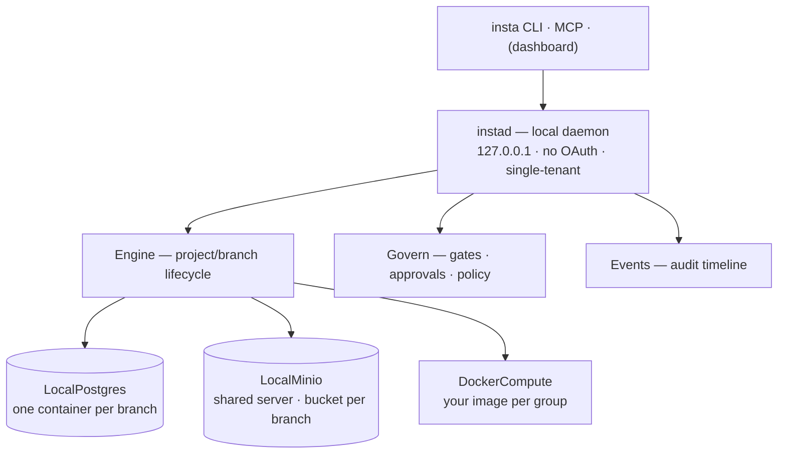

# insta-oss

**insta-oss** — a self-hostable runtime for **branchable, agent-native environments**.
Every project gets a database, object storage, and your app containers; every **branch is a
disposable, fully isolated clone** of all three. Runs anywhere Docker runs — single-tenant,
no accounts, no billing, no external services.

Driven by the standard **`insta` CLI** (its default API URL is already `http://localhost:8080`,
so it works out of the box). Workflows built here run unchanged on managed Instacloud.

## What it can do (v1)

- **Projects with real resources** — `project create` provisions a Postgres container, an
  S3 bucket (shared MinIO), and compute slots for your app images.
- **Branch = a disposable isolated environment** — `branch create` clones the whole stack:
  database copied (`pg_dump` → restore), bucket copied (`mc mirror`), every app group
  re-deployed against the clone. Writes to a branch never touch its source (test-verified).
- **Deploy your own compute** — `deploy --image you/app` runs your container per compute
  group, injected with that branch's `DATABASE_URL` + S3 credentials. Redeploy = replace.
- **The secret seam** — `insta secrets` is the only way credentials leave the daemon:
  `DATABASE_URL`, `AWS_ACCESS_KEY_ID/SECRET`, `AWS_ENDPOINT_URL_S3`, `AWS_REGION`,
  `BUCKET_NAME` — standard Postgres/S3 env vars, so apps need no insta-specific code.
- **Governance (HITL)** — `secrets.read | deploy | project.delete | branch.delete` gate to
  allow/deny/approve; approvals are one-shot (`approve --always` makes it permanent);
  per-project `policy set`.
- **Audit timeline** — every resource + govern action lands in `insta events`; agents ingest
  findings via `POST /projects/:id/events` with dedup (observe-hook compatible).
- **Agent-legible manifest** — `insta manifest` prints each branch's db / storage / compute.

Full roadmap and what's deliberately not in v1: [`docs/superpowers/plans/2026-07-02-insta-oss-roadmap.md`](docs/superpowers/plans/2026-07-02-insta-oss-roadmap.md).

## Architecture



## Getting started (from zero)

**Prerequisites:** Docker (running) and Node ≥ 22. Nothing else — no cloud account, no API keys.

### 1. Spawn the daemon

```bash
git clone git@github.com:InsForge/insta-oss.git && cd insta-oss
npm install
npx tsx src/main.ts               # instad on 127.0.0.1:8080  (INSTA_OSS_PORT=4800 to change)
```

First run pulls `postgres:16-alpine`, `minio/minio`, `minio/mc` — give it a minute.
Keep this terminal open (daemon runs in the foreground for now).

### 2. Get the `insta` CLI

```bash
# quick try (always the newest version — the CLI is young and updates often):
npx insta@latest status
# for regular use — native binary, no Node required (macOS/Linux/WSL; checksum-verified):
curl -fsSL https://raw.githubusercontent.com/InsForge/insta-cli/main/install.sh | sh
# or, with Node:  npm install -g insta
```

> The CLI is evolving fast (v0.0.x). If an installed `insta` misbehaves, update it first —
> re-run the installer (idempotent) or `npm update -g insta`.

No `insta login` needed — the daemon trusts localhost and has a builtin `local` user.
If the daemon isn't on the default port: `export INSTA_API_URL=http://127.0.0.1:4800`.

### 3. Spawn a project (db + storage + compute)

```bash
cd ~/my-app          # the CLI links the project to your cwd (./.insta/project.json)
insta project create demo
#   resources: postgres, storage, compute
insta secrets --print          # DATABASE_URL + AWS_* S3 bundle for branch main
```

Behind the scenes: a `io-demo-main-pg` Postgres container, a `io-demo-main` bucket on the
shared MinIO, and a Docker network per branch. `project create` also installs the related
agent skills into your project (`.agents/skills/`, gitignored) so coding agents know the workflow.

### 4. Spawn your app into it (custom compute)

```bash
insta deploy --image ghcr.io/you/app:latest --port 8080
# → http://localhost:8080 — container gets DATABASE_URL + the S3 creds injected
insta deploy --image ghcr.io/you/api:latest --port 3000 --group backend   # more compute groups
```

**`--port` = the port your app listens on inside the container** (it's also the host port for
direct deploys). Give the container a few seconds to boot before hitting the URL.
Your app just reads `process.env.DATABASE_URL` / the `AWS_*` vars — same code runs on the cloud.

### 5. Spawn a branch — a full isolated clone

```bash
insta branch create feat       # copies the db + bucket, redeploys your app groups
insta manifest                 # see both branches with their own db/storage/compute
insta branch switch feat && insta secrets   # .env now points at the clone
```

Branch apps keep the **same listen port** but map to **host port +1000** (e.g. main on
`localhost:8080` → feat on `localhost:9080`; `insta manifest` shows each URL).
Break anything in `feat` — `main` is untouched. Throw it away with `insta branch delete feat`.

### 6. Govern it (the HITL circuit breaker)

```bash
insta policy set deploy approve      # now deploys need a human
insta deploy --image you/app:v2 --port 8080
# → approval required — run: insta approvals approve <id>
insta approvals approve <id> --always   # approve AND stop asking
insta events                            # the full audit timeline
```

### Use it with an AI agent

The runtime is agent-native out of the box — **the agent skills install themselves**:

- `insta project create` / `link` auto-installs the **`insta` skill** (the workflow playbook:
  branch-per-task, secrets seam, approvals) plus the Neon-Postgres / Tigris-S3 / Better-Auth
  skills into your project (`.claude/skills/` for Claude Code, `.agents/skills/` for Codex —
  gitignored). Any agent opened in the repo picks them up automatically and knows how to
  drive `insta` correctly.
- It also installs the **observe hook** (`./.insta/observe`) — a credential-audit hook that
  scans the agent's tool calls for secret leaks and reports findings to `insta events`.
- Installed already / different agent? Add manually: `npx skills add InsForge/insta-skills -s insta`

Then just point the agent at the daemon (`INSTA_API_URL` if not on the default port) and
let it work: each agent can `branch create` its own disposable environment, develop, test,
and delete it — while `policy` + `approvals` keep destructive actions behind a human.
(MCP server over the same endpoints: coming.)

### Troubleshooting

| Symptom | Fix |
| --- | --- |
| `Docker is required and must be running` | start Docker Desktop / dockerd |
| port 8080 in use (e.g. platform dev server) | `INSTA_OSS_PORT=4800 npx tsx src/main.ts` + `export INSTA_API_URL=http://127.0.0.1:4800` |
| first commands slow | one-time image pulls (postgres/minio/mc) |
| where's my state? | `~/.insta-oss/state.json` (override with `INSTA_OSS_STATE`) |
| `io-minio` container never goes away | by design — it's the shared storage server holding every branch's buckets |

### Uninstall / clean slate

```bash
insta project delete            # per project (approval-gated)
docker rm -f io-minio           # shared storage server (deletes all buckets)
docker ps -aq --filter name=io- | xargs docker rm -f   # any strays
rm -rf ~/.insta-oss             # daemon state
```

## Test

```bash
npm test        # 10 API-contract tests (no Docker) + 2 real-Docker isolation tests (db + bucket)
```

## Code structure

```
insta-oss/
├── src/
│   ├── main.ts                 entry point — starts instad on 127.0.0.1 (checks Docker first)
│   ├── server.ts               HTTP layer (Fastify): the standard API surface + govern gating
│   │                           of sensitive routes (202 approval flow); cloud-only routes → 501
│   ├── engine.ts               core orchestration: project/branch lifecycle, deploy,
│   │                           clone = db copy + bucket copy + app redeploy, teardown
│   │                           with compensation, audit-event emission
│   ├── govern.ts               HITL policy engine: allow/deny/approve per action,
│   │                           one-shot grants, `--always` → permanent allow
│   ├── state.ts                single-tenant persistence (~/.insta-oss/state.json):
│   │                           projects · branches · policies · approvals · events
│   ├── types.ts                the model + adapter contracts (Database/Compute/Storage)
│   ├── docker.ts               one helper: spawn the docker CLI, capture stdout, stdin pipe
│   └── adapters/               swappable providers behind the contracts in types.ts
│       ├── postgres.ts         LocalPostgres — container per branch; clone = pg_dump→restore
│       ├── compute.ts          DockerCompute — your image per group; listen port fixed,
│       │                       host port mapped (branch clones shift host side only)
│       └── storage.ts          LocalMinio — one shared server, bucket per branch;
│                               clone = mc mirror; S3 creds minted per branch
├── test/
│   ├── server.test.ts          API contract tests (fake adapters, no Docker, ~100ms)
│   ├── clone-isolation.int.test.ts   real Docker: db clone is copied AND isolated
│   └── storage.int.test.ts     real Docker: bucket clone is copied AND isolated
├── docs/superpowers/plans/     capabilities + phased roadmap
└── .github/workflows/ci.yml    typecheck + lint + full test suite on every push/PR
```

**How a request flows:** CLI/MCP → `server.ts` (route + govern gate) → `engine.ts`
(orchestration + state + events) → an adapter (`adapters/*`) → `docker.ts` → Docker.
The engine never talks to Docker directly for resources — only through the adapter contracts.

**Where to extend:**

- **Different database/storage/compute backend** → implement the matching interface in
  `types.ts` as a new file in `src/adapters/`, wire it in `main.ts`. Nothing else changes —
  the engine, server, tests, and CLI are provider-agnostic.
- **New endpoint** → don't. The surface mirrors the standard `insta` CLI (see parity table);
  additions belong in the shared CLI/platform contract first.
- **Behavior change** → contract test in `server.test.ts` (fast, fake adapters) and, if it
  touches containers or clone isolation, an integration test alongside the existing two.

## CLI command support

insta-oss implements the standard `insta` command surface — no custom commands.
Verified by running every registered CLI command against the daemon:

| Command | insta-oss behavior |
| --- | --- |
| `status` | ✅ (`user: local`) |
| `org list` | ✅ builtin single org (`local`) |
| `project create/link/list/delete` | ✅ (delete is govern-gated) |
| `branch create/switch/delete/list` | ✅ (create = clone: db copy + bucket copy + app redeploy) |
| `deploy` | ✅ (govern-gated) |
| `secrets` / `secrets list` | ✅ full bundle: `DATABASE_URL` + `AWS_*` + `BUCKET_NAME` (gated) |
| `manifest` | ✅ per-branch postgres / storage / compute |
| `policy` / `policy set` | ✅ |
| `approvals list/approve/deny` (`--always`) | ✅ one-shot grants, same 202 flow |
| `events` | ✅ resource + govern timeline, agent ingest with dedup |
| `login/logout` | not needed — localhost trust, no accounts |
| `metrics` / `logs` | 501 with clear message (docker stats/logs planned — roadmap Phase 2) |
| `usage` / `billing` | 501 — no metering/billing in insta-oss |
| `org create` / `tokens` | 501 — single-tenant |

**Branching vs merging:** `branch` = a disposable isolated environment (clone). There is no
`branch merge` — merge happens at the **git level**: merge your code, run migrations against
main, redeploy, delete the branch env. Branch data never merges back.
