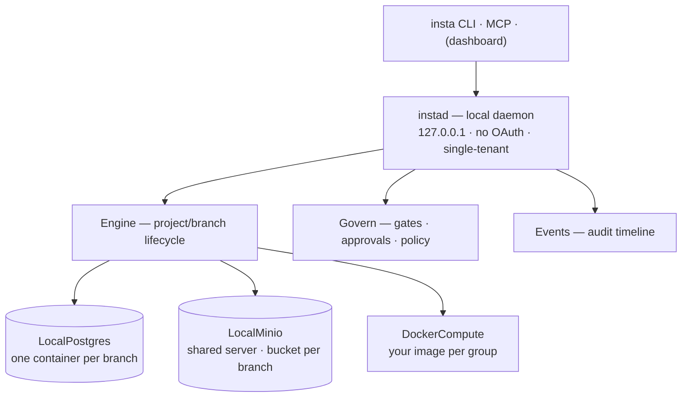

# insta-oss

**Instacloud-oss** — the open-source, self-hostable runtime behind [Instacloud](https://github.com/InsForge/insta-cloud).
Runs anywhere Docker runs. Same branchable, agent-native workflow as the managed cloud —
on local containers, single-tenant, no accounts, no billing.

**The stock `insta` CLI works unchanged**: this daemon serves the same API surface
(paths + response shapes) as the Instacloud platform, and the CLI's default API URL is
already `http://localhost:8080`. MCP gets the same property — one thin client, two targets.

## What it can do (v1)

- **Projects with real resources** — `project create` provisions a Postgres container, an
  S3 bucket (shared MinIO), and compute slots for your app images.
- **Branch = a disposable isolated environment** — `branch create` clones the whole stack:
  database copied (`pg_dump` → restore), bucket copied (`mc mirror`), every app group
  re-deployed against the clone. Writes to a branch never touch its source (test-verified).
- **Deploy your own compute** — `deploy --image you/app` runs your container per compute
  group, injected with that branch's `DATABASE_URL` + S3 credentials. Redeploy = replace.
- **The secret seam** — `insta secrets` is the only way credentials leave the daemon:
  `DATABASE_URL`, `AWS_ACCESS_KEY_ID/SECRET`, `AWS_ENDPOINT_URL_S3`, `AWS_REGION`,
  `BUCKET_NAME` — the same key names the cloud mints, so the same app runs on both.
- **Governance (HITL)** — `secrets.read | deploy | project.delete | branch.delete` gate to
  allow/deny/approve; approvals are one-shot (`approve --always` makes it permanent);
  per-project `policy set`.
- **Audit timeline** — every resource + govern action lands in `insta events`; agents ingest
  findings via `POST /projects/:id/events` with dedup (observe-hook compatible).
- **Agent-legible manifest** — `insta manifest` prints each branch's db / storage / compute.

Full roadmap and what's deliberately not in v1: [`docs/superpowers/plans/2026-07-02-insta-oss-roadmap.md`](docs/superpowers/plans/2026-07-02-insta-oss-roadmap.md).

## Architecture



| | Instacloud (cloud) | insta-oss (this repo) |
| --- | --- | --- |
| db / storage / compute | Neon / Tigris / Fly (microVM) | Postgres / MinIO / Docker containers |
| branch (clone) | CoW | copy (`pg_dump` + bucket mirror) — isolated |
| compute on branch | re-deploy | re-deploy (same semantics) |
| governance (HITL) + events | ✅ | ✅ same gates, one-shot grants, `--always` |
| auth | OAuth | none — localhost trust |
| orgs / billing / usage / metrics | ✅ | 501 (cloud-only) |

## Getting started (from zero)

**Prerequisites:** Docker (running) and Node ≥ 20. Nothing else — no cloud account, no API keys.

### 1. Spawn the daemon

```bash
git clone git@github.com:InsForge/insta-oss.git && cd insta-oss
npm install
npx tsx src/main.ts               # instad on 127.0.0.1:8080  (INSTA_OSS_PORT=4800 to change)
```

First run pulls `postgres:16-alpine`, `minio/minio`, `minio/mc` — give it a minute.
Keep this terminal open (daemon runs in the foreground for now).

### 2. Get the `insta` CLI

The same CLI that drives the cloud. Until it's on npm, run it from source:

```bash
git clone git@github.com:InsForge/insta-cli.git && cd insta-cli && npm install
alias insta='npx tsx ~/insta-cli/src/index.ts'     # or: npm run build && link the binary
```

No `insta login` needed — the daemon trusts localhost and has a builtin `local` user.
If the daemon isn't on the default port: `export INSTA_API_URL=http://127.0.0.1:4800`.

### 3. Spawn a project (db + storage + compute)

```bash
cd ~/my-app          # the CLI links the project to your cwd (./.insta/project.json)
insta project create demo
#   resources: postgres, storage, compute
insta secrets --print          # DATABASE_URL + AWS_* S3 bundle for branch main
```

Behind the scenes: a `io-demo-main-pg` Postgres container, a `io-demo-main` bucket on the
shared MinIO, and a Docker network per branch.

### 4. Spawn your app into it (custom compute)

```bash
insta deploy --image ghcr.io/you/app:latest --port 8080
# → http://localhost:8080 — container gets DATABASE_URL + the S3 creds injected
insta deploy --image ghcr.io/you/api:latest --port 8090 --group backend   # more compute groups
```

Your app just reads `process.env.DATABASE_URL` / the `AWS_*` vars — same code runs on the cloud.

### 5. Spawn a branch — a full isolated clone

```bash
insta branch create feat       # copies the db + bucket, redeploys your app groups
insta manifest                 # see both branches with their own db/storage/compute
insta branch switch feat && insta secrets   # .env now points at the clone
```

Break anything in `feat` — `main` is untouched. Throw it away with `insta branch delete feat`.

### 6. Govern it (the HITL circuit breaker)

```bash
insta policy set deploy approve      # now deploys need a human
insta deploy --image you/app:v2 --port 8080
# → approval required — run: insta approvals approve <id>
insta approvals approve <id> --always   # approve AND stop asking
insta events                            # the full audit timeline
```

### Use it with an AI agent

Point any coding agent (Claude Code, Cursor, …) at the daemon and let it drive the CLI:
each agent can `branch create` its own disposable environment, work, and delete it —
while `policy` + `approvals` keep destructive actions behind a human. Set
`INSTA_API_URL` in the agent's environment; the `insta-skills` playbook teaches the workflow.
(MCP server: same endpoints, coming via the `mcp/` submodule.)

### Troubleshooting

| Symptom | Fix |
| --- | --- |
| `Docker is required and must be running` | start Docker Desktop / dockerd |
| port 8080 in use (e.g. platform dev server) | `INSTA_OSS_PORT=4800 npx tsx src/main.ts` + `export INSTA_API_URL=http://127.0.0.1:4800` |
| first commands slow | one-time image pulls (postgres/minio/mc) |
| where's my state? | `~/.insta-oss/state.json` (override with `INSTA_OSS_STATE`) |
| `io-minio` container never goes away | by design — it's the shared storage server holding every branch's buckets |

### Uninstall / clean slate

```bash
insta project delete            # per project (approval-gated)
docker rm -f io-minio           # shared storage server (deletes all buckets)
docker ps -aq --filter name=io- | xargs docker rm -f   # any strays
rm -rf ~/.insta-oss             # daemon state
```

## Test

```bash
npm test        # 10 API-contract tests (no Docker) + 2 real-Docker isolation tests (db + bucket)
```

## Layout

```
src/main.ts            daemon entry (instad)
src/server.ts          the platform-compatible API surface
src/engine.ts          project/branch lifecycle (clone = copy + redeploy)
src/govern.ts          HITL gates · policies · one-shot approvals
src/adapters/          local providers: postgres (copy-branching) · docker compute · shared MinIO (bucket-per-branch)
src/state.ts           single-tenant JSON state
docs/superpowers/      plans (capabilities + roadmap)
```

## CLI command parity (stock `insta` CLI vs this daemon)

The OSS follows the canonical CLI/cloud command surface exactly — no OSS-only commands.
Verified by running every registered CLI command against the daemon:

| Command | insta-oss behavior |
| --- | --- |
| `status` | ✅ (`user: local`) |
| `org list` | ✅ builtin single org (`local`) |
| `project create/link/list/delete` | ✅ (delete is govern-gated) |
| `branch create/switch/delete/list` | ✅ (create = clone: db copy + bucket copy + app redeploy) |
| `deploy` | ✅ (govern-gated) |
| `secrets` / `secrets list` | ✅ full bundle: `DATABASE_URL` + `AWS_*` + `BUCKET_NAME` (gated) |
| `manifest` | ✅ per-branch postgres / storage / compute |
| `policy` / `policy set` | ✅ |
| `approvals list/approve/deny` (`--always`) | ✅ one-shot grants, same 202 flow |
| `events` | ✅ resource + govern timeline, agent ingest with dedup |
| `login/logout` | cloud-only (no OAuth locally — localhost trust) |
| `metrics` / `logs` | 501 with clear message (docker stats/logs planned — roadmap Phase 2) |
| `usage` / `billing` | 501 — cloud-only by design (no metering in OSS) |
| `org create` / `tokens` | 501 — single-tenant |

**Branching vs merging:** `branch` = a disposable isolated environment (clone). There is no
`branch merge` in the cloud or here — merge happens at the **git level**: merge your code,
run migrations against main, redeploy, delete the branch env. Branch data never merges back.
